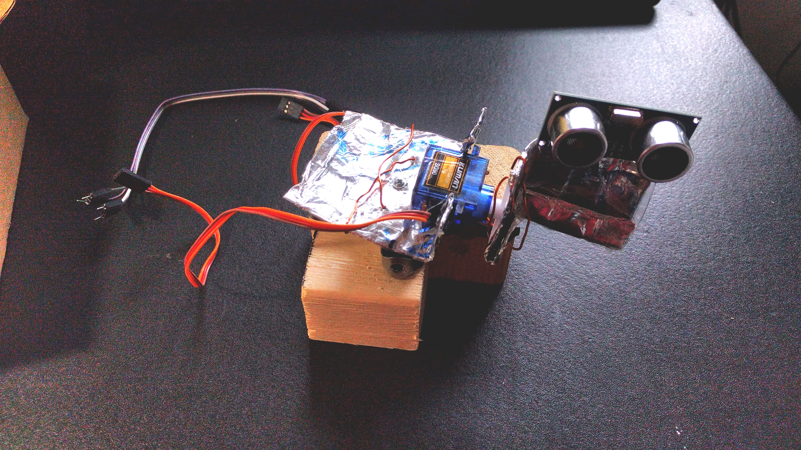
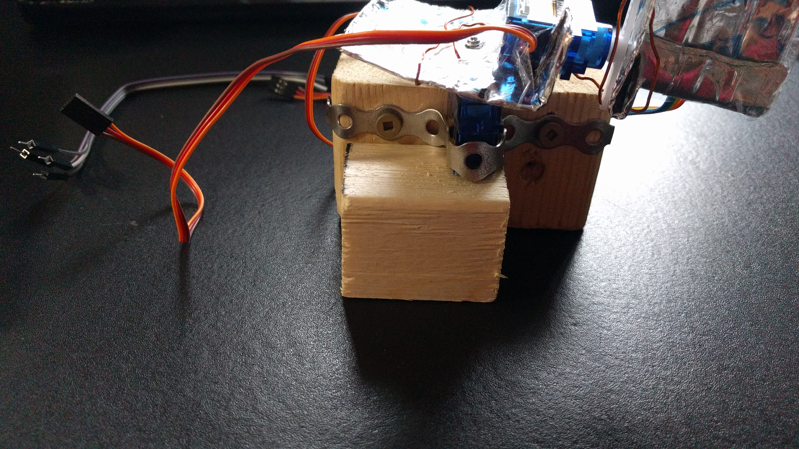
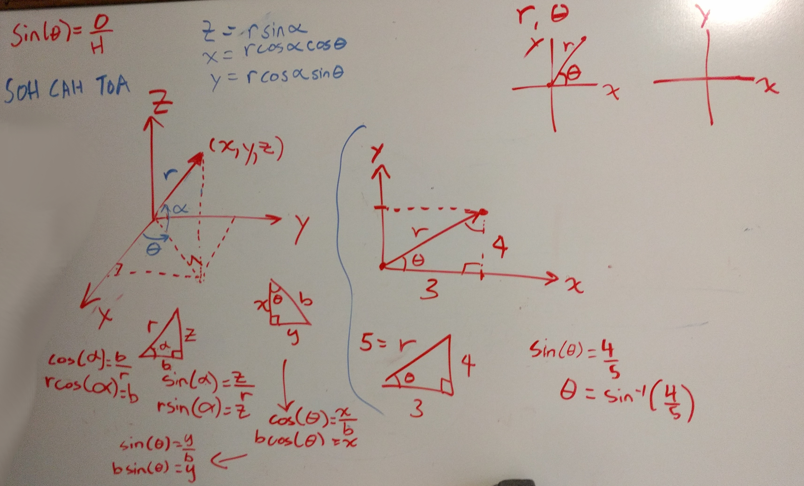

# LidarScanner3D
Made using Arduino and Unreal Engine 4.

*Compiled exe is available in the releases of this repository.*

This program and setup that I have created from scratch allows you to create and map a point cloud using LIDAR, Arduino, and Unreal Engine. The real time visualization tool was made in Unreal Engine, and the LIDAR interfaced with the Arduino Mega using UART and I2C communication protocol. The angle calculations and many bug fixes have been done to ensure the best performance is there when in use.

Scan of a sofa using a Lidar Lite V3 (the white cylindrical thing is the location the LIDAR is scanning from):

## Instructions
- Hook up everything to the arduino based on the ciruit diagrams below
- Depending on the type of LIDAR, upload that code to arduino
- Run the LidarScanner.exe file , specify com port, baud rate, scan type and go from there

## Help
When trying to load in Unreal Engine 4:
- Remember to rename the .sav file to ScanDataSave.sav
- It goes in .\LidarScanner3D\LidarScannerUE4\Saved\SaveGames

When trying to load in the LidarScanner compiled .exe file:
- Go to .\LidarScannerUE4Compiled\LidarScanner\Saved\SaveGames and find ScanDataSave.sav
- Note: This file has the point cloud data
- If wanted, copy or move it out into a different folder to keep for later and can rename it to something like "room.sav"
- To load back in, name the file as ScanDataSave.sav and move it to the "SaveGames" folder

## Circuit Diagrams (made by me using Fritzing)
Circuit Diagram for Lidar Lite V3 using perfboard:

Circuit Diagram for Lidar Lite V3 using breadboard:

Circuit Diagram for TFMini Plus (the wiring from the TFMini Plus is based on the colors in the diagram):

## Frame Pictures
### First Frame (Prototype V1)

### New Frame (V2)
This new and improved aluminum frame was hand built and designed by me. It allows for easy portability, rotation, and great stability.

## Point calculations
Here is a picture of the angle calculations I did for finding the exact location of the point relative to the LIDAR:

