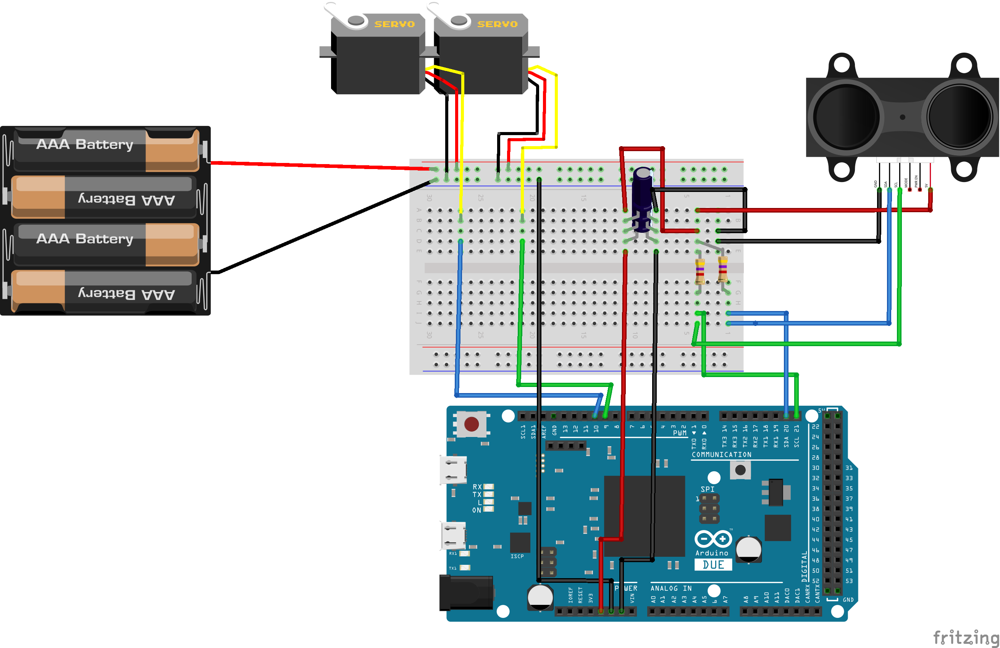
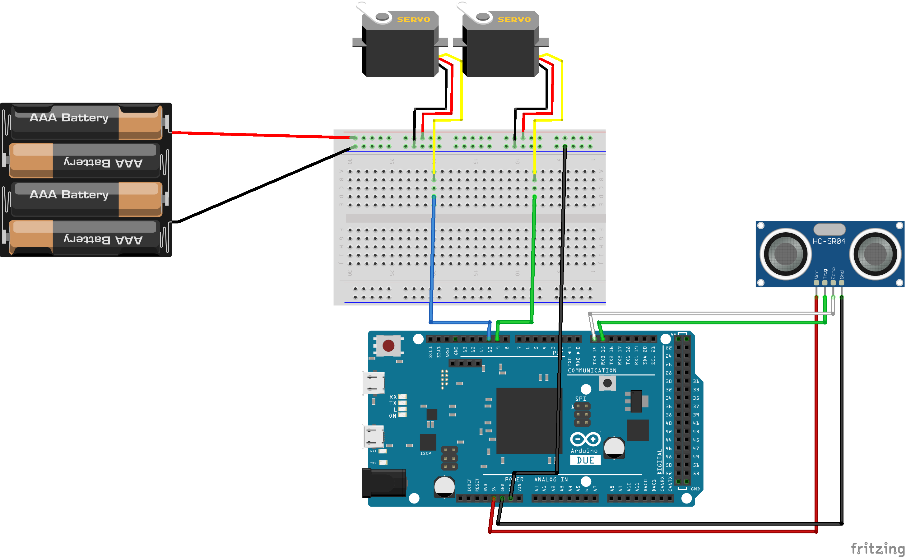
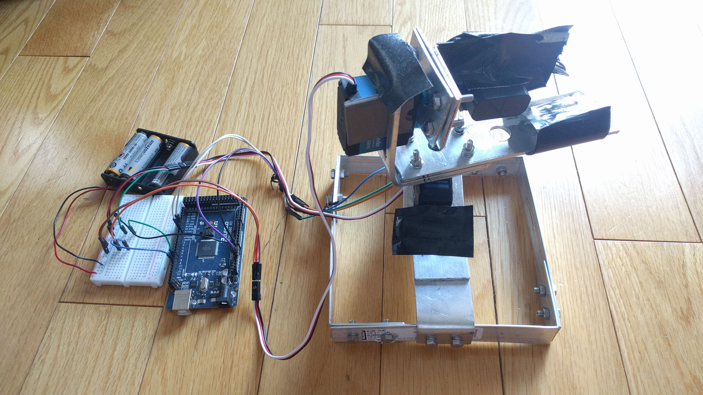

# LidarScanner3D

I designed and implemented a system from scratch which allows you to map a point cloud of your environment and nearby objects using LIDAR, Arduino, and Unreal Engine 4. 

I made the real time visualization tool using Unreal Engine and interfaced the LIDAR with an Arduino Mega using UART and I2C communication protocols.

Example scan of a sofa using a Lidar Lite-V3 (the white color in the middle is the location this scanning system):

Demonstration of the Lidar rotation with real-time mapping display:

## Instructions to Run
- Hook everything up to the Arduino according to the [circuit  diagrams below](#circuit-diagrams)
- Upload the appropriate Arduino code, depending on which LIDAR you are using
- Run the `LidarScanner.exe` application, specify `Com Port`, `baud rate`, `scan type` and go from there

*Note: The `exe` is available in the releases of this repository.*

## Help/Tips
When trying to load a previously saved scan into Unreal Engine 4 project:
- Remember to rename the `.sav` file to `ScanDataSave.sav`
- The file goes in `.\LidarScanner3D\LidarScannerUE4\Saved\SaveGames`

When trying to load a previously saved scan into the comipled `LidarScanner.exe`:
- Go to `.\LidarScannerUE4Compiled\LidarScanner\Saved\SaveGames` and find `ScanDataSave.sav`
    - Note: This file has the point cloud data
- If wanted, copy or move it out into a different folder to keep for later and can rename it to something like `room.sav`
- To load back in, name the file as `ScanDataSave.sav` and move it to the `SaveGames` folder

## Circuit Diagrams

I have interfaced the Lidar Lite V3 and TFMini Plus Lidar range finders with an Arduino Mega. I chose to do this using a perfboard for easy development and modularity. Some circuit schematics I made in Fritzing are shown below:

For Lidar Lite V3 using perfboard:

For Lidar Lite V3 using breadboard:

For TFMini Plus:

 (Note: Replace the Sonar in the diagram with a TFMini Plus. The wiring from the TFMini Plus is based on the colors in the diagram).

## Mechanical Design 
Although I made the [first prototype out of wood](./Pics/LidarScannerPic5.jpg), the final design for the Lidar pan-and-tilt was hand built from Aluminum plates. It allows for easy portability, rotation, and great stability.

## Point calculations
The LIDAR sensor measures a distance to the object, and the current orientation of this sensor is given by the servo positions. The angle calculations I did for finding the exact location of the point relative to the LIDAR in 3D Space using vector geometry are shown below:

